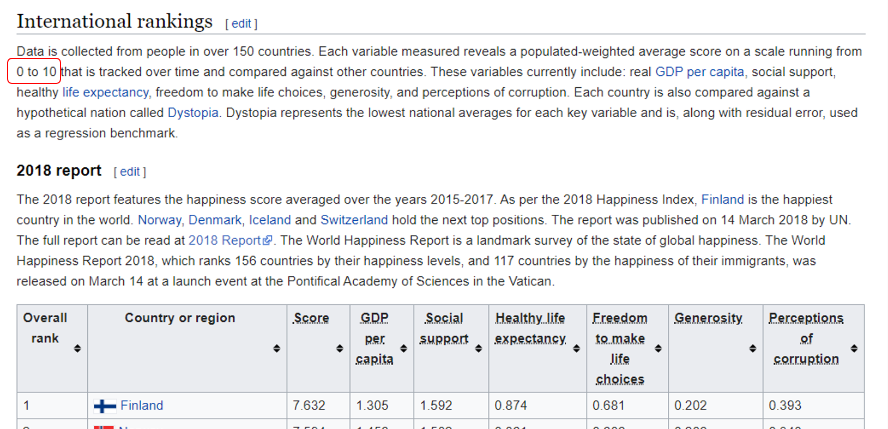

<center></center>

<center> <header><h1>ESTADISTICA PARA EL ANALISIS POLITICO II</h1>  </header></center>

* Profesor:  <a href="http://www.pucp.edu.pe/profesor/jose-manuel-magallanes/" target="_blank">Dr. José Manuel Magallanes, Ph.D.</a> <br>
    - Profesor del Departamento de Ciencias Sociales, Sección de Ciencia Política y Gobierno.
    - [Oficina 105](https://goo.gl/maps/xuGeG6o9di1i1y5m6) - Edificio CISEPA / ECONOMIA / CCSS
    - Telefono: (51) 1 - 6262000 anexo 4302
    - Correo Electrónico: [jmagallanes@pucp.edu.pe](mailto:jmagallanes@pucp.edu.pe)
    

____

<center> <header><h2>BONUS: Creación de intervalos</h2>  </header></center>
____

Muchas veces necesitamos crear intervalos a partir de una variable numerica. Por ejemplo, TheEconomist crea intervalos con el _SCORE_ y luego le da nombre a cada grupo. Eso NO es clusterizar, pero es buebno saberlo. Usemos la data del [indice de felicidad](https://en.wikipedia.org/wiki/World_Happiness_Report)


```{r, warning=FALSE, message=FALSE}
# bibliotecas:
library(htmltab)


# coleccion
links=list(web="https://en.wikipedia.org/wiki/World_Happiness_Report",
           xpath ='//*[@id="mw-content-text"]/div/table/tbody')
feliz =htmltab(doc = links$web, which =links$xpath)
names(feliz)
```
 
```{r}
# limpieza
names(feliz)=gsub('\\s','',names(feliz))
feliz[,]=lapply(feliz[,], trimws,whitespace = "[\\h\\v]")
names(feliz)
```
 
 
```{r}
str(feliz)
```
 
```{r}

# preparación
feliz[,-c(2)]=lapply(feliz[,-c(2)], as.numeric) # a numerico
row.names(feliz)=feliz$Countryorregion


# veamos que tenemos:
str(feliz)
```
 
```{r}
# que se perdio??
feliz[!complete.cases(feliz),]
```
 
```{r}
#data sin pedidos:
feliz=feliz[complete.cases(feliz),] # un pais menos
```

## Creando intervalos:

1. Saca descriptivos:

```{r}
summary(feliz$Score)
```
 
 2. Determina maximos y minimos:
 
 Estos deben aparecer en el reporte:
 
 
 
 
 3. Crea los intervalos segun el ANCHO de cada intervalo.
 
 Aqui necesitas a **cut()**:
 
 
```{r}
# puntos de corte (incluye min y max)
CORTES=c(0,2.5,5,7.5,10)

# corta y crea "nueva" variable:
feliz$ScoreCut=cut(feliz$Score,breaks = CORTES, ordered_result = TRUE)
```
 
 
 Mira resultado:
 
```{r}
table(feliz$ScoreCut)
```
 
 Puedes quedarte con ello, pero podrias crear tres grupos para evitar grupo con cero:
 
```{r}
# puntos de corte (incluye min y max)
CORTES2=c(0,3.3,6.6,10) # 4 CORTES
NOMBRES2=c("BAJO","MEDIO","ALTO") # 4-1 NOMBRES (en orden)

# corta y crea "nueva" variable:
feliz$ScoreCut2=cut(feliz$Score,breaks = CORTES2, 
                    labels = NOMBRES2,
                    ordered_result = TRUE)
```
 
 Mira resultado nuevo:
 
```{r}
table(feliz$ScoreCut2)
```
 
 Esta puede ser tu nueva columna validadora cuando NO la HAY. De aqui, calcula clusters y compara como hacias con del _Democracy Index_.
 
_____

Volver a [Preparación de tablas de datos](https://htmlpreview.github.io/?https://github.com/PoliticayGobiernoPUCP/estadistica_anapol2/blob/master/FormateoTabla.html)
 